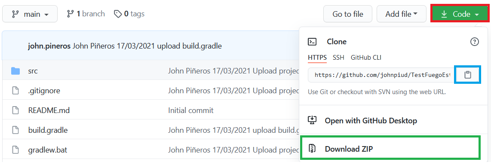
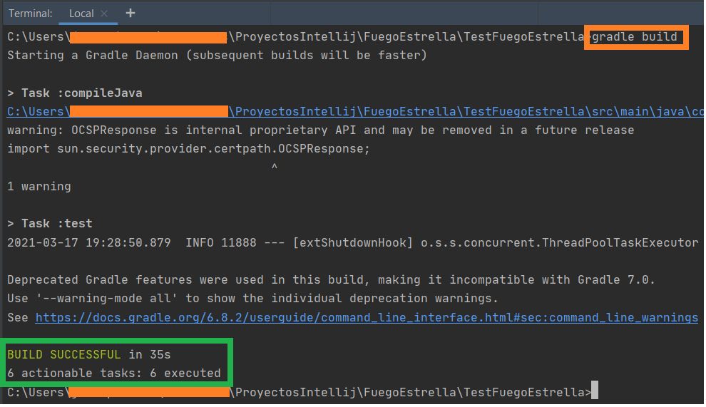
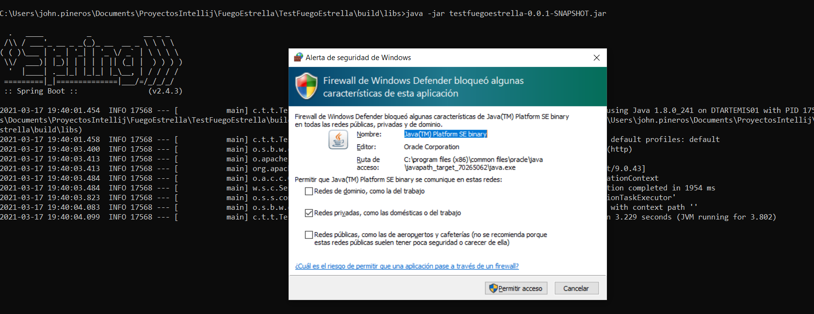
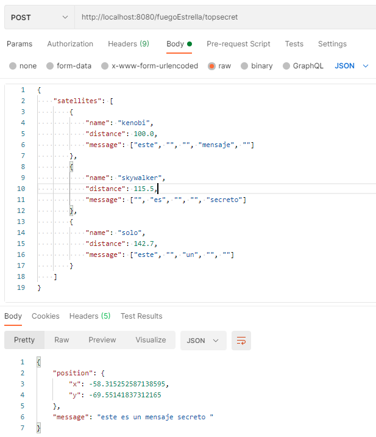
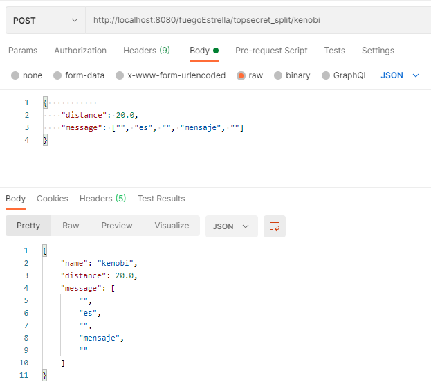
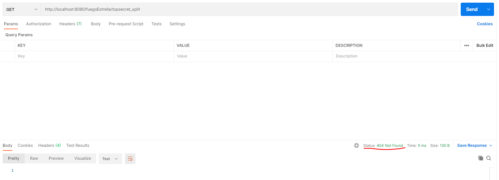
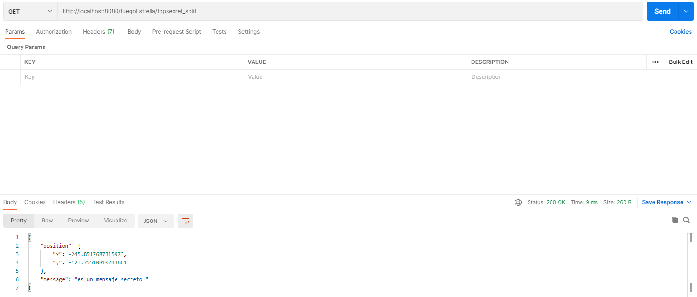

# TestFuegoEstrella
## Descarga proyecto

Figura 1. Descargar proyecto.

Una vez ubicado en el repositorio se debe pulsar en el botón en el recuadro rojo para descargar el proyecto o para clonarlo.
El botón en el recuadro azul es para clonarlo y la opción en el recuadro verde es para descargarlo como un archivo .zip.

## Crear JAR
Antes de crear el JAR, se debe tener instalado JAVA y Gradle en el sistema. Una vez descargado o clonado el proyecto, se debe abrir la consola del sistema, puede ser CMD o powershell en windows.

Figura 2. Crear JAR del proyecto.

Nos ubicamos en la ruta del proyecto y se ejecuta el comando `gradle build`. Al finalizar se debe mostrar un mensaje como se muestra en el recuadro verde de la Figura 2.

Si por algún motivo no es posible crear el JAR, en la carpeta Documentos se encuentra un JAR de la apliacación.

## Ejecutar JAR

Figura 3. Ejecutar JAR

En la consola ubicarse en la ruta ruta_proyecto\build\libs y ejecutar el comando `java -jar testfuegoestrella-0.0.1-SNAPSHOT.jar`. Al ejecutar el comando la aplicación comenzará a ejecutarse y saldrá un mensaje del sistema solicitando permisos. Aceptar el permiso para que se ejecute con éxito la aplicación.

## Consumir Servicios
Para probar los servicios se usa postman. En la carpeta Documentos se encuentra un archivo RequestServicios.txt el cual tiene el request usado para consumir los servicios POST respectivos.

### Servicio POST Nivel 2
URL_SERVICIO: http://localhost:8080/fuegoEstrella/topsecret

Figura 4. Consumir servicio nivel 2 en Postman.

En la Figura 4 se observa la configuración en Postman, el request y la respuesta obtenida del servicio.

### Servicio POST Nivel 3
URL_SERVICIO: http://localhost:8080/fuegoEstrella/topsecret_split/{satellite_name}

Opciones satellite_name:
- kenobi
- skywalker
- solo

Figura 5. Consumir servicio nivel 3 POST en Postman.

En la Figura 5 se observa la configuración en Postman, el request y la respuesta obtenida del servicio.

### Servicio GET Nivel 3
URL_SERVICIO: http://localhost:8080/fuegoEstrella/topsecret_split

Figura 6. Consumir servicio nivel 3 GET en Postman sin datos.

En la Figura 6 se observa la configuración en Postman, el request y la respuesta obtenida del servicio cuando no hay datos o no se puede obtener la posición o el mensaje.

Figura 7. Consumir servicio nivel 3 GET en Postman.

En la Figura 7 se observa la configuración en Postman, el request y la respuesta obtenida del servicio cuando hay datos en memoria de al menos dos satélites.
 
